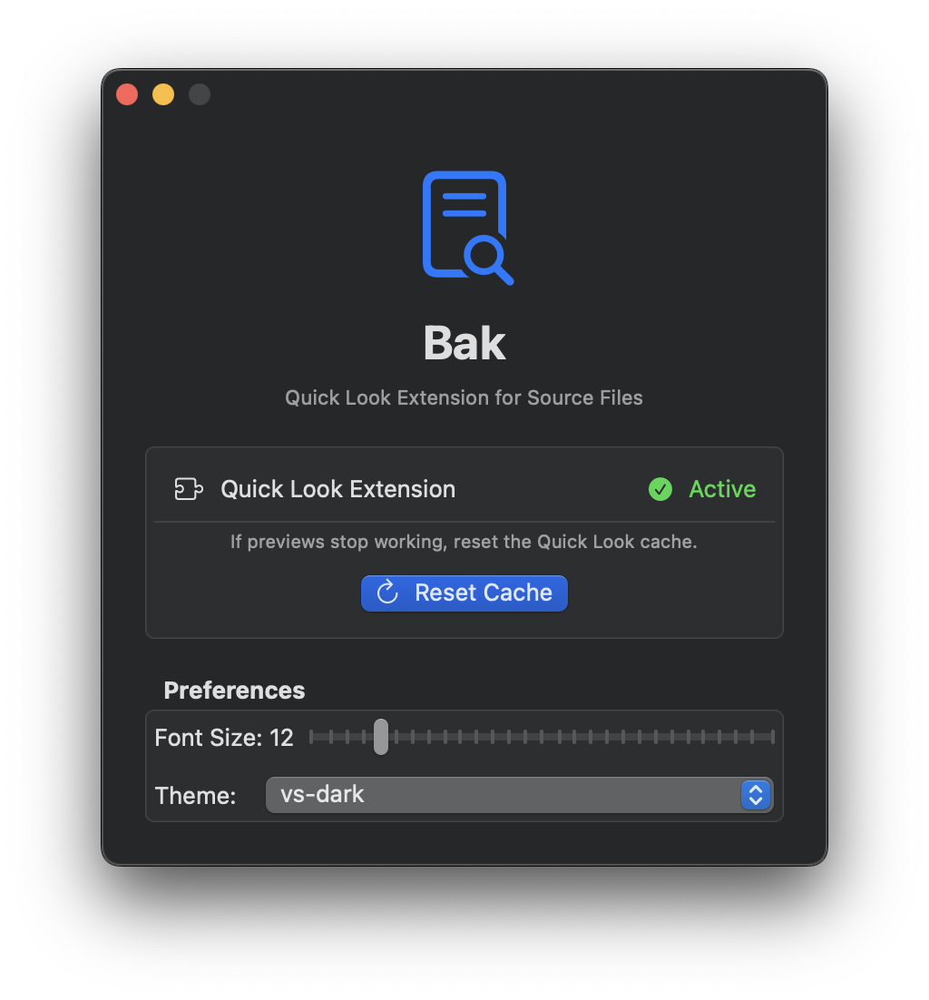
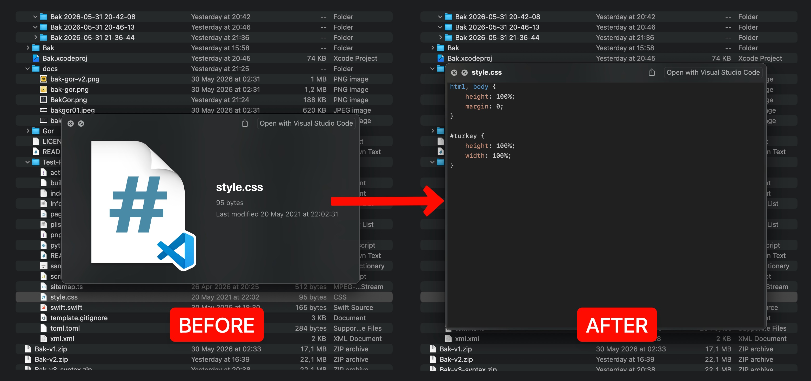

<h1 align="center">Bak.Gör</h1>
<p align="center">A native macOS Quick Look extension on steroids. Experience instant syntax highlighting and customizable themes right inside Finder.</p>
<!--p align="center">﹏﹏ ‿︵ ﹏﹏</p-->

<p align="center">・・・・・・・・・・ ༄ ・・・・・・・・・・</p> 
<p align="center">
Download the app from <a href="https://github.com/alptugan/Bak/releases/latest">Releases</a><br>
(Requires minimum Mac OS 11.0 - 15.7).<br>
<strong style="color:#ff9900">⚠️ PLEASE FOLLOW "Installation" & "Troubleshoot" instructions ⚠️</strong>
</p>
<br>
<p align="center">
    
    
</p>

<p align="center"> ⁂ </p>

## Overview
Bak.Gör is a macOS Quick Look extension that previews plain-text-based files directly in Finder via the Space key. (`XCode 15+`, `Swift 5.9+`, `MacOS 15.7+`)

**Supported File Types:**
Thanks to the underlying highlight engine, Bak.Gör natively supports syntax highlighting for **100+ programming languages and text formats**, including but not limited to:
- **Web & Data:** `HTML`, `CSS`, `JavaScript`, `TypeScript`, `JSON`, `XML`
- **Languages:** `Swift`, `Python`, `C`, `C++`, `Java`, `Ruby`, `Go`, `Rust`
- **Scripts & Configs:** `Bash`, `Shell`, `YAML`, `TOML`, `Markdown`
- **Creative Coding:** `Processing (*.pde)`, `Arduino (*.ino)`
- And dozens more standard plain-text source files.

<p style="margin-top:20px" align="center">

</p>

<br/>
<p align="center"> ⁂ </p>

## Motivation
Whenever I need to quickly review a `CSS`, `JSON`, or any other source code file, I usually have to double-click and wait for the IDE like VS Code or Xcode to initialize. I just want to hit the Space key in Finder and see the formatted, syntax-highlighted inside of the document instantly. To overcome this tedious process, I've developed Bak.Gör. The name of the extension is derived from Turkish:

- **Bak** = Look
- **Gör** = See

<br/>
<p align="center"> ⁂ </p>

## Installation
1. Download the latest <a href="https://github.com/alptugan/Bak/releases/latest">release</a>. 
2. Move the app to your Applications folder.
3. Copy `Bak.app` to `/Applications`.
4. Launch the `Bak.app` ⚠️ **once**, and set your preferred theme and font-size.
5. Open **System Settings → General → Quick Look**.
6. Enable **Gor**.
7. Click on any source code file and hit space.

<p style="margin-top:20px" align="center">

</p>


### Troubleshoot
1. If the extension doesn't preview `CSS` files, try the followings;

    - While holding down `Option` key, right-click on the `Finder` icon and choose `relaunch`

        or

    - Reset Quick Look cache and try again. Or try "Reset Cache" button on the app.


2. **The app cannot be opened**, etc... Gate Keeper related issues. Refer to the [section](https://github.com/alptugan/icns-creator#option-1-disable-the-gate-keeper-recommended).
    - Sometimes unsigned apps should be dequaratined. Refer to run the following code or use apps like [this](https://github.com/alienator88/Sentinel/tree/main). 
    
        Run this command to strip away the Apple quarantine flag (which is attached automatically when the file is downloaded or transferred):
    
        `xattr -cr /Applications/Bak.app` 
    - Run this command to force a fresh Ad-Hoc signature onto the app using the new Mac's internal security credentials:

        `codesign --force --deep --sign - /Applications/Bak.app`


<br/>
<p align="center"> ⁂ </p>

## Architecture
- Bak — Host SwiftUI app (required container for the extension)
- Gor — Quick Look Preview Extension (the actual previewer)
- License: [GPL-3.0](https://github.com/alptugan/Bak/blob/6051b31ce56e64833cc7b989cf78af2a700491c6/LICENSE)

```shell
Bak/
├── BakApp.swift                            # SwiftUI app entry point (container)
├── ContentView.swift                       # Placeholder UI
Gor/
├── PreviewViewController.swift             # Active QL preview controller (view-based)
├── PreviewProvider.swift                   # Data-based QL provider (unused)
├── Info.plist                              # Extension config & supported UTIs
├── Base.lproj/PreviewViewController.xib
```

<br/>
<p align="center"> ⁂ </p>

## Dependencies & Acknowledgments
**[HighlighterSwift](https://github.com/smittytone/HighlighterSwift)**: This project leverages HighlighterSwift for fast and reliable syntax highlighting. HighlighterSwift is distributed under the MIT License, and its core engine, *Highlight.js*, operates under the BSD 3-Clause License.

<br/>
<p align="center"> ⁂ </p>

## Contact

If you have any questions, suggestions, or feedback, please feel free to use Issues section.
