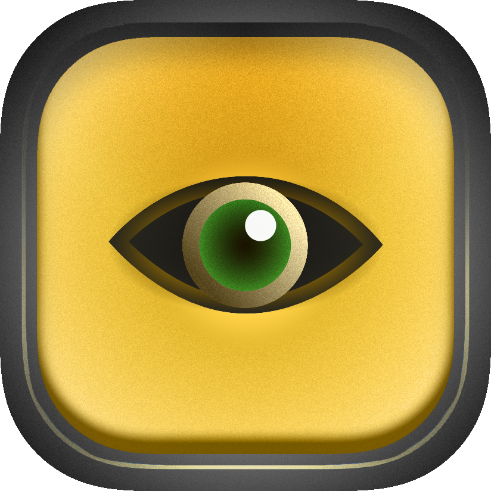
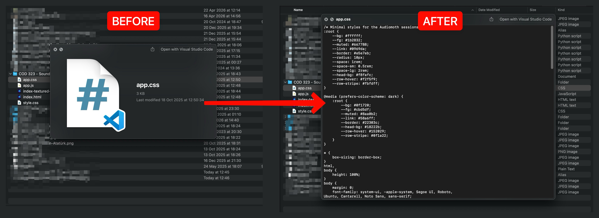
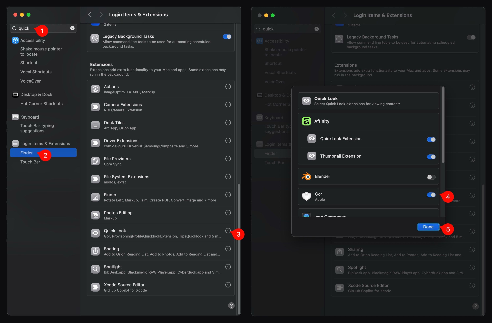

# Bak.Gör (Alpha) — Technical Documentation
<br>
<p align="center">

</p>


## Overview
Bak.Gör is a macOS Quick Look extension that previews plain-text-based files (source code, CSS, plain text) directly in Finder via the Space key. (`XCode 15+`, `Swift 5.9+`)

<p style="margin-top:20px" align="left">
(WIP) MacOS quicklook extension to preview CSS files via space key. More file types will be added in the future release of the extension. 
</p>

<p style="margin-top:20px" align="center">

</p>

## Motivation
Whenever I need to quickly check `CSS` files, I have to double-click and wait for VS Code to initialized, etc... I've just wanted to hit Space key and see what is inside of the `CSS` document quickly. To overcome this tedious process, I've developed Bak.Gör. The name of the of the extensin is in Turkish. 

Bak = Look

Gör = See 


## Installation (End User)
The deployed version will be released later...

<p style="margin-top:20px" align="center">

</p>

1. Clone the repo.
2. Build an archive in Xcode (`Product → Archive → Distribute App → Direct Distribution`).
3. Copy `Bak.app` to `/Applications`.
4. Launch once, then enable the extension in System Settings.
5. Open **System Settings → Privacy & Security → Extensions → Quick Look** (or on older macOS: System Preferences → Extensions).
6. Enable **Gor**.


### Troubleshoot
If the extension doesn't preview `CSS` files, try the followings;

1. While holding down `Option` key, right-click on the `Finder` icon and choose `relaunch`

or

2. Reset Quick Look cache and try again.
```
qlmanage -r
qlmanage -r cache
```


## Architecture:
- Bak — Host SwiftUI app (required container for the extension)
- Gor — Quick Look Preview Extension (the actual previewer)
- License: [GPL-3.0](https://github.com/alptugan/Bak/blob/6051b31ce56e64833cc7b989cf78af2a700491c6/LICENSE)

```shell
Bak/
├── BakApp.swift                            # SwiftUI app entry point (container)
├── ContentView.swift                       # Placeholder UI
Gor/
├── PreviewViewController.swift             # Active QL preview controller (view-based)
├── PreviewProvider.swift                   # Data-based QL provider (unused)
├── Info.plist                              # Extension config & supported UTIs
├── Base.lproj/PreviewViewController.xib
```
